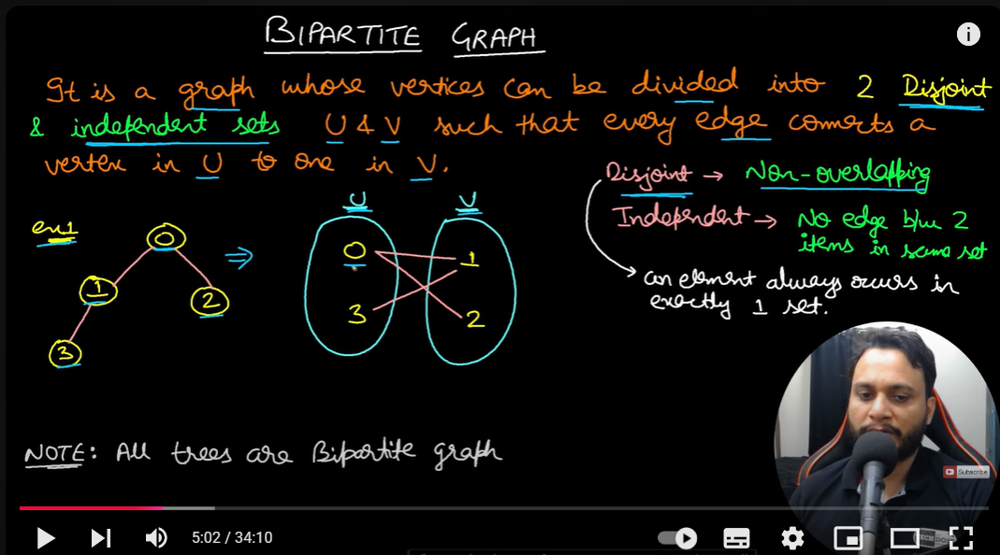

## Everything 
<pre>
Basic Mathematics
Arithmetic
Basic Operations
Addition
Subtraction
Multiplication
Division
Order of Operations
PEMDAS/BODMAS
Fractions and Decimals
Simplifying Fractions
Converting between Fractions and Decimals
Percentages
Calculations involving percentages
Percentage increase/decrease
Number Theory

Integers and Properties
Even and Odd Numbers
Prime Numbers
Composite Numbers
Primality Test
Divisibility Rules
Basic divisibility rules (2, 3, 5, etc.)
Greatest Common Divisor (GCD)
Euclidean Algorithm (Basic and Extended)
Least Common Multiple (LCM)
Modular Arithmetic
Basic Concepts
Congruences
Modular Exponentiation
Modular Inverses
Chinese Remainder Theorem | Set 1 (Introduction)
Euler's Totient Function
Lucas Theorem to Compute nCr % p
Wilson's Theorem
Möbius Function
Algebra
Basic Algebra
Variables and Expressions
Simplifying expressions
Linear Equations
Solving single-variable equations
Systems of linear equations
Inequalities
Solving and graphing linear inequalities
Quadratic inequalities
Absolute value inequalities
Advanced Algebra

Polynomials
Operations on polynomials (addition, subtraction, multiplication)
Factoring polynomials
Quadratic Equations
Solving quadratic equations (factoring, quadratic formula)
Exponents and Logarithms
Laws of exponents
Solving exponential equations
Introduction to logarithms
Sequences and Series
Arithmetic and geometric sequences
Summation notation and formulas
Fibonacci Sequence
Geometry
Basic Geometry
Points, Lines, and Angles
Types of angles (acute, right, obtuse)
Parallel and perpendicular lines
Triangles
Types of triangles (equilateral, isosceles, scalene)
Pythagorean theorem
Pythagorean Triple
Triangle inequality theorem
Quadrilaterals and Polygons
Properties of squares, rectangles, parallelograms, etc.
Area and perimeter formulas
Advanced Geometry

Circles
Radius, diameter, circumference, area
Arcs and sectors
Coordinate Geometry
Distance formula
Midpoint formula
Equation of a line (slope-intercept form, point-slope form)
How to check if two given line segments intersect?
How to check if a given point lies inside or outside a polygon?
Transformations
Translations, rotations, reflections, and dilations
Convex Hull
Jarvis's Algorithm or Wrapping
Graham Scan
Closest Pair of Points
Bentley–Ottmann Algorithm
Trigonometry
Basic Trigonometric Functions
Sine, cosine, tangent
Basic identities and formulas
Right Triangle Trigonometry

Solving right triangles
Pythagorean identities
Unit Circle

Understanding and using the unit circle
Graphs of Trigonometric Functions

Graphing sine, cosine, and tangent functions
Calculus**(You can skip these on for now)**
**** 11. Basic Calculus 1. Limits and Continuity — Understanding limits — Continuity of functions 2. Derivatives — Basic differentiation rules — Applications of derivatives (tangents, optimization) 3. Integrals — Basic integration techniques — Definite and indefinite integrals — Applications of integrals (area under a curve)

Discrete Mathematics
Set Theory

Basic concepts (sets, subsets, unions, intersections)
Venn diagrams
Logic and Boolean Algebra

Propositional logic
Boolean expressions and truth tables
Combinatorics

Permutations and combinations
Binomial theorem
Graph Theory

Basic terminology (vertices, edges, paths, cycles)
Graph traversal algorithms (BFS, DFS)
Shortest path algorithms (Dijkstra's, Bellman-Ford)
Mathematical Induction

Advanced Topics for Competitive Programming
Advanced Number Theory

Sieve of Eratosthenes
Segmented Sieve
Fermat's Little Theorem
Chinese Remainder Theorem
Modular Exponentiation
Modular multiplicative inverse
Advanced Algebra

Matrix operations
Eigenvalues and eigenvectors
Matrix Exponentiation
Probability and Statistics

Basic probability concepts
Random variables and distributions
Normal Distribution
Binomial Distribution
Poisson Distribution
Game Theory

Grundy Numbers
Sprague-Grundy Theorem
Game of Nim
Additional Resources

Practice and Learning Platforms
Khan Academy: Comprehensive lessons on all topics from basic to advanced mathematics.
Coursera and edX: Online courses from universities on various math topics.
YouTube Channels: Channels like 3Blue1Brown, Numberphile, PatrickJMT, and Math The Beautiful.
By following this structured list, you can gradually build up your math skills from the very basics to the advanced topics needed for competitive programming.
</pre>
